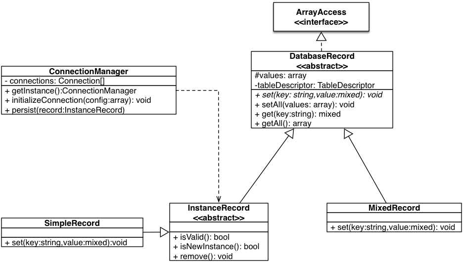

## Principles

In PandaBase, rows of tables and rows of queries can be interpreted as a DatabaseRecord. So when you try to modify a specific
row in a table or try to iterate over result of a query you have access to values via set() and get() methods.



DatabaseRecord also implements ArrayAccess interface, thus you can manipulate the values as in case of array.
(For example if you use Twig as rendering engine, you are able to add the object directly to the parameter list.)

```php

$record->set("column_1",10);
echo $record->get("column_1");

$record["column_1"] = 20;
echo $record["column_1"];

```

### Difference between MixedRecord and InstanceRecord

You have to use MixedRecords when you have a query which contains columns of more table. Conversely, an InstanceRecord
can interpreted as row of one table, thus you can use it when you write only simple queries which use one table from database.
Because every InstanceRecord is a row in a table, you can save modification or remove it from the table.